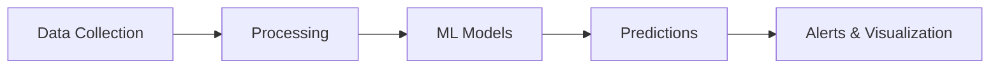
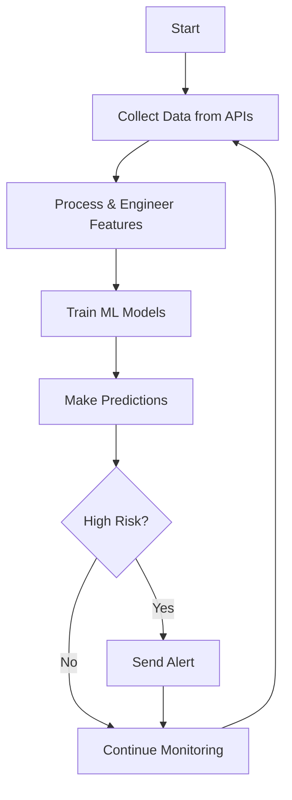
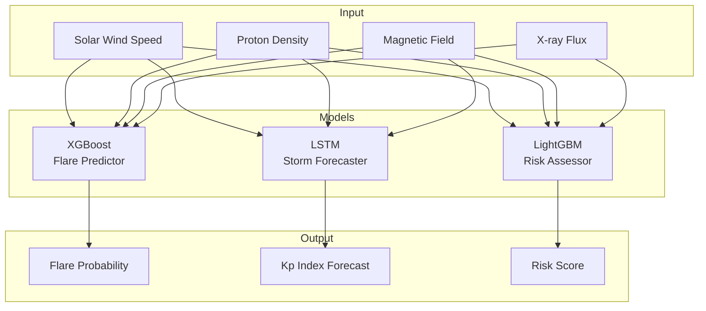
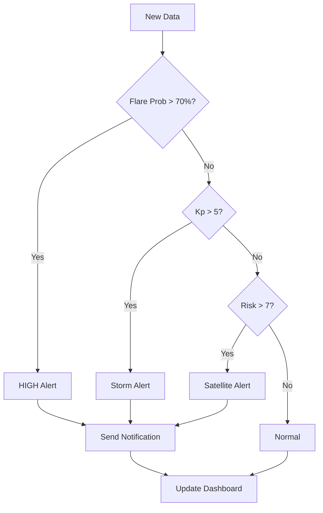
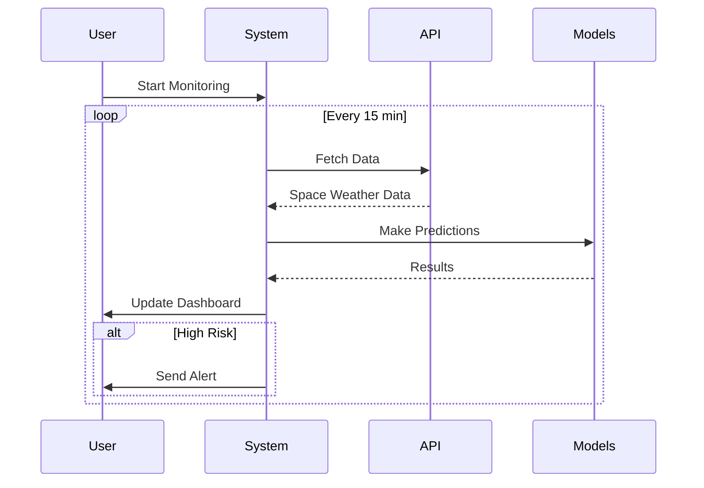
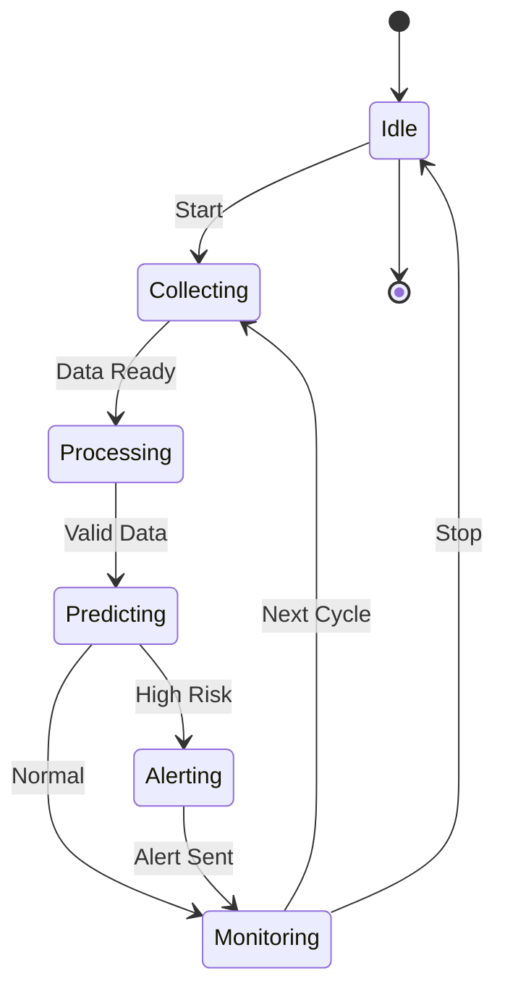
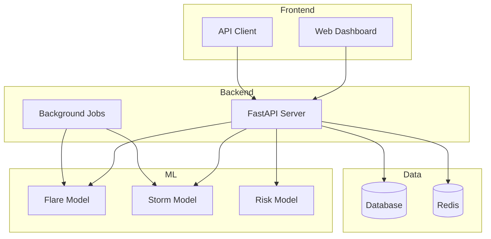

# Space Weather System - Simple Diagrams

## System Overview

## Data Flow

## Model Architecture

## Alert System

## Sequence Diagram

## State Diagram

## Component Diagram

---

**Note**: These diagrams will render automatically on GitHub, GitLab, and most markdown viewers that support Mermaid.
