# 🌌 Space Weather Prediction System - Flow Diagrams

## 1. Overall System Architecture


## 2. Data Collection Flow


## 3. Machine Learning Pipeline


## 4. Prediction & Alert Flow

```mermaid
flowchart TD
    A[New Data Arrives] --> B[Load Trained Models]
    B --> C[Preprocess Data]
    
    C --> D1[Flare Prediction]
    C --> D2[Storm Forecast]
    C --> D3[Risk Assessment]
    
    D1 --> E{Flare Prob > 70%?}
    D2 --> F{Kp Index > 5?}
    D3 --> G{Risk > 7?}
    
    E -->|Yes| H1[🔴 HIGH Alert]
    E -->|No| I1[Check Moderate]
    F -->|Yes| H2[🔴 Storm Alert]
    F -->|No| I2[Monitor]
    G -->|Yes| H3[🔴 Satellite Alert]
    G -->|No| I3[Normal Ops]
    
    I1 --> J{Prob > 40%?}
    J -->|Yes| K1[🟡 MODERATE Alert]
    J -->|No| L1[🟢 LOW]
    
    H1 --> M[Generate Alert]
    H2 --> M
    H3 --> M
    K1 --> M
    
    M --> N[Send Notifications]
    N --> O[Update Dashboard]
    O --> P[Log Event]
    
    L1 --> O
    I2 --> O
    I3 --> O
```



## 5. Real-Time Monitoring System

```mermaid
sequenceDiagram
    participant User
    participant System
    participant DataCollector
    participant Models
    participant AlertSystem
    participant Dashboard
    
    User->>System: Start Monitoring
    
    loop Every 15 minutes
        System->>DataCollector: Fetch Latest Data
        DataCollector->>DataCollector: Query NOAA/NASA APIs
        DataCollector-->>System: Return Space Weather Data
        
        System->>Models: Make Predictions
        Models->>Models: Flare Prediction
        Models->>Models: Storm Forecast
        Models->>Models: Risk Assessment
        Models-->>System: Return Predictions
        
        System->>AlertSystem: Check Alert Conditions
        
        alt High Risk Detected
            AlertSystem->>User: 🔴 Send Alert
            AlertSystem->>Dashboard: Update Status
        else Moderate Risk
            AlertSystem->>User: 🟡 Send Warning
            AlertSystem->>Dashboard: Update Status
        else Normal Conditions
            AlertSystem->>Dashboard: Update Status
        end
        
        Dashboard-->>User: Display Real-time Data
    end
```



## 6. Model Training Workflow


## 7. Data Processing Pipeline


## 8. Alert System Decision Tree


## 9. Feature Engineering Process


## 10. Deployment Architecture


## 11. Model Prediction Flow (Detailed)


## 12. System State Machine


---

## How to Use These Diagrams

### In Documentation
Copy the mermaid code blocks into any markdown file. GitHub, GitLab, and many documentation tools render them automatically.

### In Presentations
Use tools like:
- Mermaid Live Editor: https://mermaid.live/
- Draw.io: Import mermaid syntax
- VS Code: Mermaid preview extensions

### In README
Add to your README.md:
```markdown
## System Architecture
```mermaid
[paste diagram code here]
```
```

These diagrams provide a complete visual understanding of your Space Weather Prediction System! 🌌
